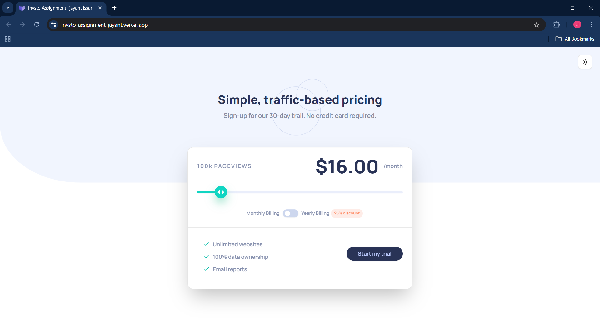
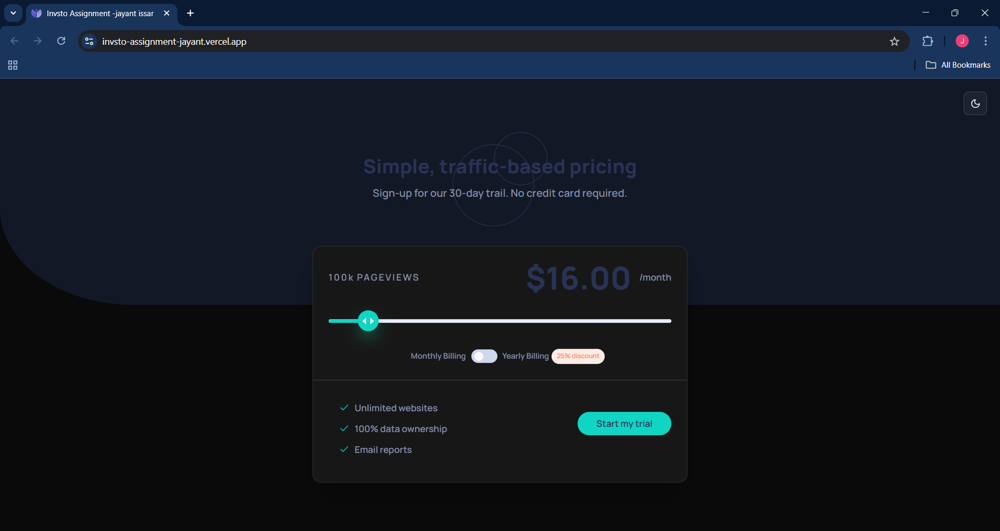
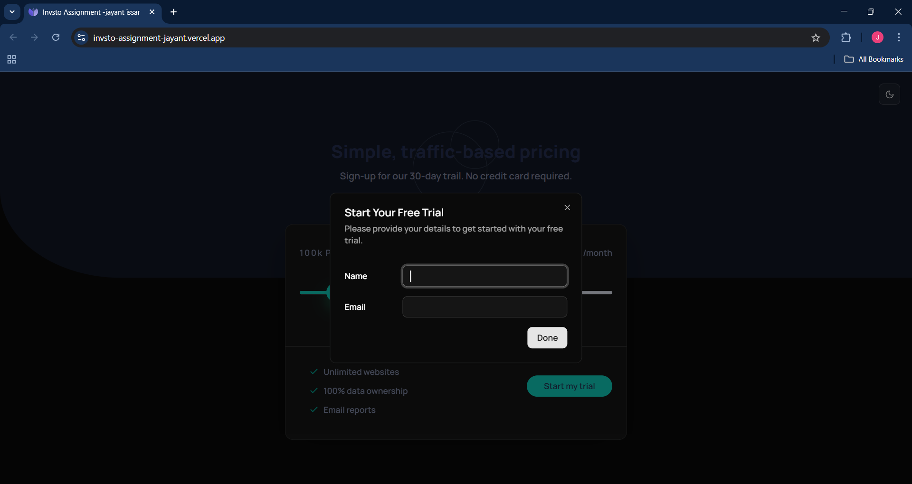
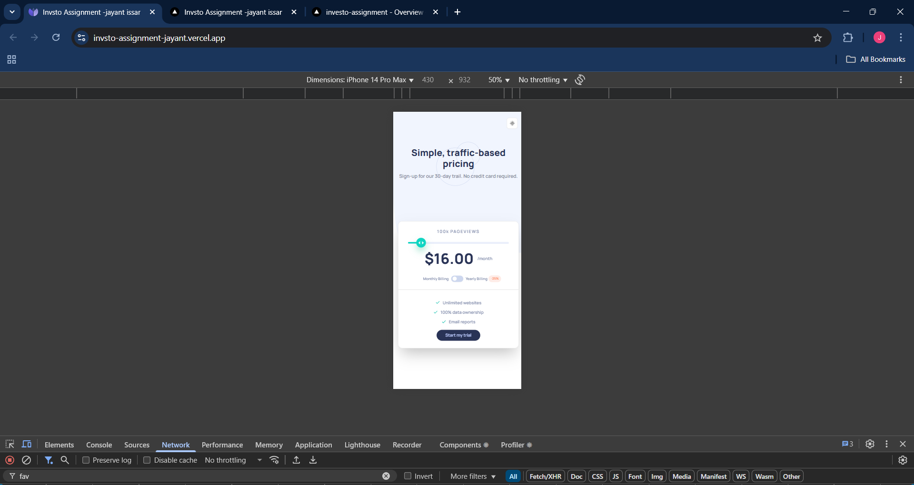
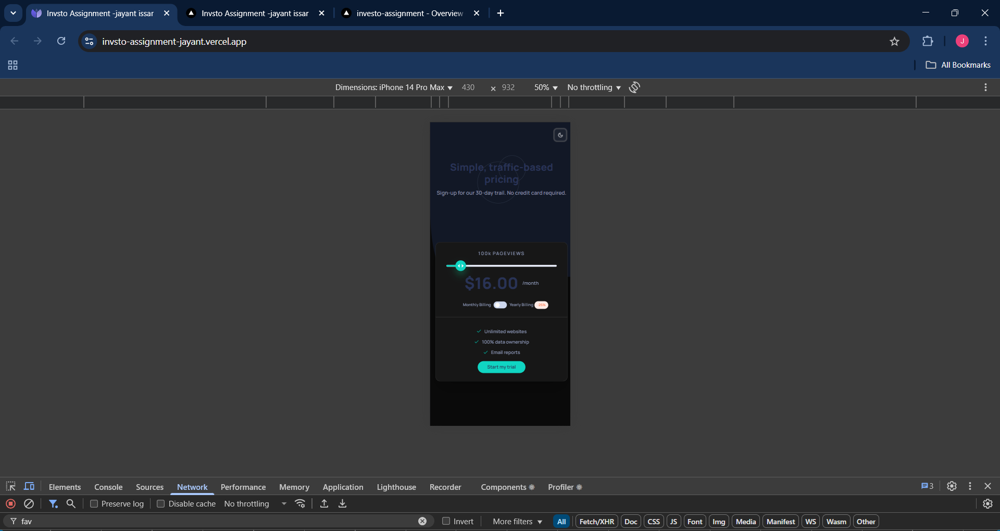

# Frontend Mentor - Interactive pricing component solution

This is a solution to the [Interactive pricing component challenge on Frontend Mentor](https://www.frontendmentor.io/challenges/interactive-pricing-component-t0m8PIyY8). 
## Table of contents

- [Overview](#overview)
  - [The challenge](#the-challenge)
  - [Screenshot](#screenshot)
  - [Links](#links)
- [My process](#my-process)
  - [Built with](#built-with)
  - [What I learned](#what-i-learned)
  - [Continued development](#continued-development)
  - [Useful resources](#useful-resources)
- [Author](#author)
- [Acknowledgments](#acknowledgments)

**Note: Delete this note and update the table of contents based on what sections you keep.**

## Overview

### The challenge

Users should be able to:

- View the optimal layout for the app depending on their device's screen size
- See hover states for all interactive elements on the page
- Use the slider and toggle to see prices for different page view numbers

### Screenshot

### Links

- Live Site URL: [Add live site URL here](https://invsto-assignment-jayant.vercel.app/)

## My process

### Built with

- Semantic HTML5 markup
- CSS custom properties
- Flexbox
- CSS Grid
- Mobile-first workflow
- [React](https://reactjs.org/) - JS library
- [Next.js](https://nextjs.org/) - React framework
- [Shadcn UI](https://shadcn.com/) - For Components

### What I learned

Learned a lot about React, Next.js, TailwindCSS, and Shadcn UI. Specially more about dark and light mode, and responsive design.

### Continued development

Will be using this experince to build more projects like this in the future, specially with building my product [Track-Trails](https://track-trails.pages.dev/).

## Author

- Website - [Jayant Issar](https://jayant-portfolio.pages.dev/)
- Twitter - [@dehatiCoder](https://www.twitter.com/dehatiCoder)

